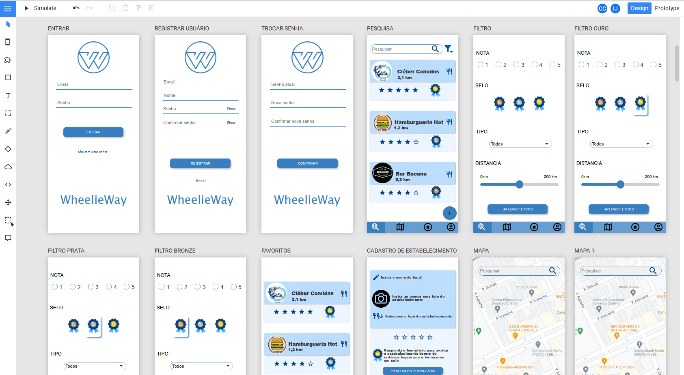
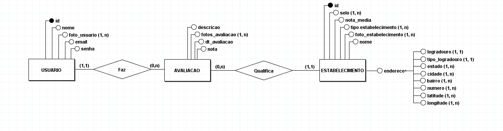
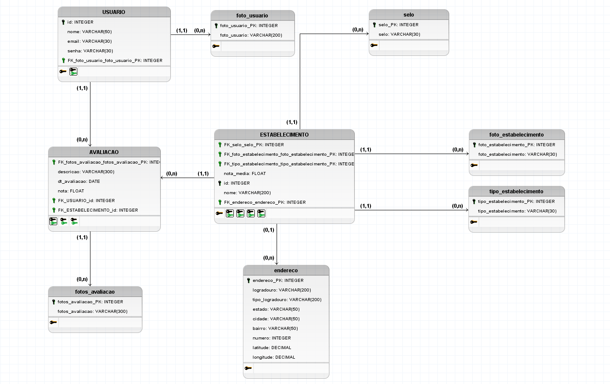
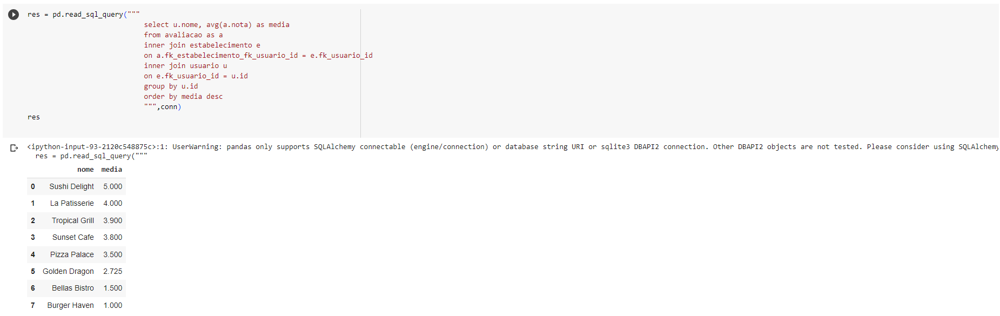
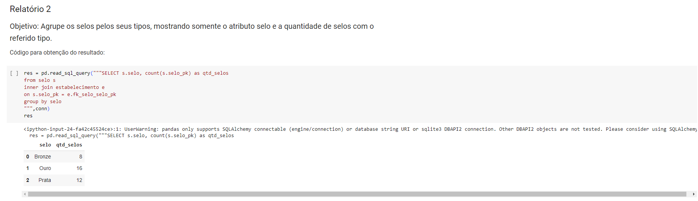
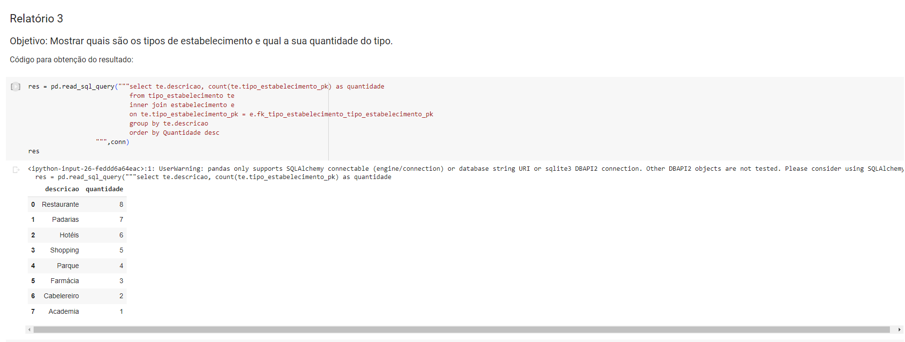
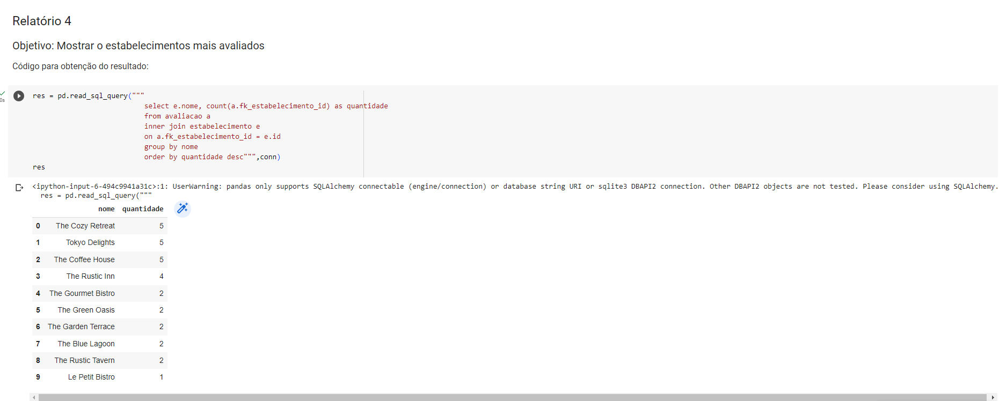
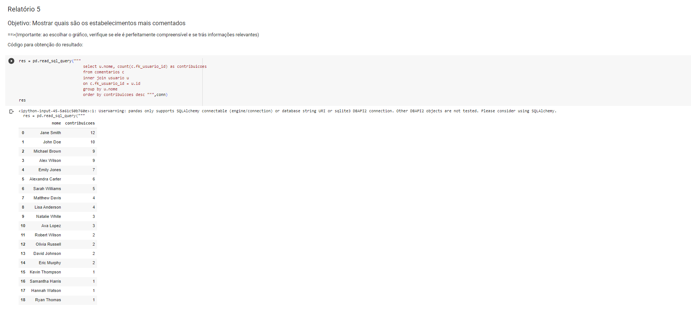

# TRABALHO DE PI:  Wheelieway: Aplicação de avaliação de estabelecimentos com base na acessibilidade
Trabalho desenvolvido durante a disciplina de Banco de Dados do Integrado
## Kanban
https://github.com/users/caiofraga123/projects/3

# Sumário
 
### 1. COMPONENTES 
Integrantes do grupo 
Rafael Barbosa Martins:rafaelmartinscouto@gmail.com 
Gabriel de Paula Brunetti:gabrieldpbrunetti@gmail.com 
Caio Fraga Coelho Cintra:caiofcintra@gmail.com 
Matheus Santos Nascimento:ifrn.jucurutu@gmail.com 

### 2.MINIMUNDO 
Descrever o mini-mundo! (Não deve ser maior do que 30 linhas, se necessário resumir para justar)
Entrevista com o usuário e identificação dos requisitos.(quando for o caso de sistemas com cliente real)
Descrição textual das regras de negócio definidas como um subconjunto do mundo real cujos elementos são propriedades que desejamos incluir, processar, armazenar, gerenciar, atualizar, e que descrevem a proposta/solução a ser desenvolvida.
 

> O sistema proposto para a "Wheelie Way" conterá as informacões aqui detalhadas. Dos Usuarios serão armazenados o id, nome, email, senha, bio e foto_perfil. De Estabelecimento será armazenado id, nome, selo, latitude, tipo_estabelecimento, longitude e foto_banner. De Avaliacao, será armazenado dt_avaliacao e nota. Um Usuario pode fazer nenhuma ou várias avaliações enquanto uma Avaliacao pode ser feita por um e por apenas um usuário. Um Estabelecimento pode ter nenhuma ou várias qualificações feitas por uma avaliação enquanto uama Avaliacao pode qualificar um e apenas um estabelecimento. De Comentarios será armazenado descricao e dt_comentario. Um Usuario pode escrever nenhum ou vários comentários enquanto uma Comentario pode ser escrito por um e por apenas um usuário. Um Estabelecimento pode ter nenhum ou várias comentários escritos enquanto um Comentario pode ser escrito sobre um e apenas um estabelecimento.
 
 
### 3.PMC 
 

#### 3.1. EAP - Estrutura Analítica do Projeto
.svg "EAP") 
##### Dicionário do EAP
 

#### 3.2. Requisitos funcionais e não funcionais
##### Requisitos funcionais
  
##### Requisitos não funcionais
  

#### 3.3 Validação da Ideia.
a) Link do formulário desenvolvido
>https://docs.google.com/presentation/d/1qrSYh5bpCSe50ds1G_YrqRBXrvAJAaLTO2YMUFZ8IF4/edit?usp=sharing

b) Link para Relatório/Apresentação de resultados obtidos
>https://docs.google.com/forms/d/e/1FAIpQLSeIjW1dLSWuLkgC4TJp6YfD5qHpMWzX4Fn65itIjeFbh9xYrg/viewform

### 4.Personas e Histórias de usuário 
a) inclusão dos Persons desenvolvidos pelo grupo 

 
 
b) inclusão das Histórias de usuário desenvolvidas pelo grupo
 
#### Template:
 Saulo Borges, animador de festa, quer localização de estabelecimentos com informações corretas quanto à acessibilidade deles. 
#### Exemplo:
 Saulo Borges: Eu quero uma plataforma que atenda as minhas necessidades físicas, para me ajudar com meu problema de acesso a locais que me acolham e respeitem as minhas dificuldades. 

### 5. PROTÓTIPOS DO SISTEMA 
Neste ponto a codificação não e necessária, somente as ideias de telas devem ser desenvolvidas. O princípio aqui é pensar na criação da interface para identificar possíveis informações a serem armazenadas e/ou descartadas  

Sugestão: https://balsamiq.com/products/mockups/ 

#### 5.1 PROTÓTIPO DO SISTEMA MOBILE
>Teste: https://quant-ux.com/#/test.html?h=a2aa10a35CHHhwHEySoH5G6qam0ce65GzUhN7BYFadNt0uannX6yJyutiZSO&ln=en 

>Telas: https://quant-ux.com/#/apps/641aeb7d05d7232656948d45/design/s10183_68866.html 

#### 5.2 PROTÓTIPO DO SISTEMA WEB
>Protótipo: https://github.com/RafaBMartins/pi2023/tree/3cbca575d3772ea636ad87d6046196004ac586e8/web 

#### 5.3 QUAIS PERGUNTAS PODEM SER RESPONDIDAS COM OS SISTEMA WEB/MOBILE PROPOSTOS?
    a) O sistema proposto poderá fornecer quais tipos de relatórios e informaçes? 
    b) Crie uma lista com os 5 principais relatórios que poderão ser obtidos por meio do sistema proposto!
    
> A Empresa DevCom precisa inicialmente dos seguintes relatórios:
* Relatório que mostre quais estabelecimentos foram avaliados e sua nota média de estrelas de classificação quanto à acessibilidade(máximo de 5)
* Relatório que agrupe os selos pelos seus tipos, mostrando somente o atributo selo e a quantidade de selos com o referido tipo.
* Relatório que mostre quais são os tipos de estabelecimento e qual a sua quantidade do tipo.
* Relatório que mostre quaal é a quantidade de avaliações aos estabelecimentos.
* Relatório que mostre os quais são os estabelecimentos mais comentados.
 
 ### 6.MODELO CONCEITUAL 
    A) Utilizar a Notação adequada (Preferencialmente utilizar o BR Modelo 3)
    B) O mínimo de entidades do modelo conceitual pare este trabalho será igual a 4.
        * informe quais são as 3 principais entidades do sistema em densenvolvimento
      (se houverem mais de 3 entidades, pense na importância da entidade para o sistema)       
    C) Principais fluxos de informação/entidades do sistema (mínimo 2).  Dica: normalmente estes fluxos estão associados as tabelas que conterão maior quantidade de dados 
    D) Qualidade e Clareza
        Garantir que a semântica dos atributos seja clara no esquema (nomes coerentes com os dados).
        Criar o esquema de forma a garantir a redução de informação redundante, possibilidade de valores null, 
        e tuplas falsas (Aplicar os conceitos de normalização abordados).   
        

      
    
#### 7 Descrição dos dados 
    [objeto]: [descrição do objeto]
    
    EXEMPLO:
    USUARIO: Tabela que armazena as informações relativas ao usuário. 
    ID: Campo que armazena o número que identifica cada usuário. 
    NOME: Campo que armazena o nome do usuário. 
    EMAIL: Campo que armazena o email do usuário. 
    FOTO_PERFIL: Campo que armazena o link da foto de perfil do usuário. 
    SENHA: Campo que armazena a senha do usuário .
    
    ESTABELECIMENTO: Tabela que armazena as informações relativas ao estabelecimento. 
    ID: Campo que armazena o número que identifica cada estabelecimento. 
    NOME: Cmapo que armazena o nome do estabelecimento. 
    LATITUDE: Campo que armazena qual será a latitude a fim de ter a localização. 
    LONGITUDE: Campo que armazena qual será a longitude a fim de ter a localização. 
    FOTO_BANNER: Campo que armazena o link que conterá a foto de banner do estabelecimento. 
    
    SELO: Campo multivalorado que armazena as informações relativas ao selo do estabelecimento. 
    TIPO_ESTABELECIMENTO: Campo multivalorado que armazena as informações relativas ao tipo do estbaelecimento. 
    
    AVALIACAO: Tabela que armazena as informações relativas à avaliação de um sobre um estabelecimento. 
    DT_AVALIACAO: Campo que armazena a data em que foi feita a avaliação. 
    NOTA: Campo que armazena a nota da avaliação feita pelo usuário sobre um estabelecimento. 
    
    COMENTARIOS: Tabela que armazena as informações relativas aos comentáris de um usuário sobre um estabelecimento. 
    DESCRICAO: Campo que armazena a descrição do usuário sobre o estabelecimento. 
    DT_COMENTARIO: Campo que armazena a data em que o cometário foi feito. 
    
### 8	RASTREABILIDADE DOS ARTEFATOS 
        a) Para que Saulo Borges acesse os locais que ele busca, ele pode acessar a tela de pesquisa ou de mapa e buscá-los.
        b) As informações da tabela Estabalecimento estão sendo usadas na tela de pesquisa, mapa, favoritos e no perfil do estabelecimento. 
### 9	MODELO LÓGICO 
        a) inclusão do esquema lógico do banco de dados
  
        b) O modelo lógico está conforme o modelo conceitual 

### 10	MODELO FÍSICO 
        
      CREATE TABLE USUARIO (
      id SERIAL PRIMARY KEY,
      email VARCHAR(75),
      senha VARCHAR(30),
      nome VARCHAR(75),
      foto_perfil VARCHAR(500)
      );
  
     CREATE TABLE ESTABELECIMENTO (
         FK_selo_selo_PK SERIAL,
         foto_banner VARCHAR(500),
         longitude VARCHAR(30),
         FK_tipo_estabelecimento_tipo_estabelecimento_PK SERIAL,
         id SERIAL PRIMARY KEY,
         latitude VARCHAR(30),
         nome VARCHAR(75)
     );
     
     CREATE TABLE AVALIACAO (
         nota FLOAT,
         dt_avaliacao DATE,
         FK_USUARIO_id SERIAL,
         FK_ESTABELECIMENTO_id SERIAL
     );
     
     CREATE TABLE COMENTARIOS (
         descricao VARCHAR(300),
         dt_comentario DATE,
         FK_USUARIO_id SERIAL,
         FK_ESTABELECIMENTO_id SERIAL
     );
     
     CREATE TABLE selo (
         selo_PK SERIAL NOT NULL PRIMARY KEY,
         selo VARCHAR(30)
     );
     
     CREATE TABLE tipo_estabelecimento (
         tipo_estabelecimento_PK SERIAL NOT NULL PRIMARY KEY,
         tipo_estabelecimento VARCHAR(30)
     );
      
     ALTER TABLE ESTABELECIMENTO ADD CONSTRAINT FK_ESTABELECIMENTO_2
         FOREIGN KEY (FK_selo_selo_PK)
         REFERENCES selo (selo_PK)
         ON DELETE NO ACTION;
      
     ALTER TABLE ESTABELECIMENTO ADD CONSTRAINT FK_ESTABELECIMENTO_3
         FOREIGN KEY (FK_tipo_estabelecimento_tipo_estabelecimento_PK)
         REFERENCES tipo_estabelecimento (tipo_estabelecimento_PK)
         ON DELETE NO ACTION;
      
     ALTER TABLE AVALIACAO ADD CONSTRAINT FK_AVALIACAO_1
         FOREIGN KEY (FK_USUARIO_id)
         REFERENCES USUARIO (id)
         ON DELETE CASCADE;
      
     ALTER TABLE AVALIACAO ADD CONSTRAINT FK_AVALIACAO_2
         FOREIGN KEY (FK_ESTABELECIMENTO_id)
         REFERENCES ESTABELECIMENTO (id)
         ON DELETE CASCADE;
      
     ALTER TABLE COMENTARIOS ADD CONSTRAINT FK_COMENTARIOS_1
         FOREIGN KEY (FK_USUARIO_id)
         REFERENCES USUARIO (id)
         ON DELETE CASCADE;
      
     ALTER TABLE COMENTARIOS ADD CONSTRAINT FK_COMENTARIOS_2
         FOREIGN KEY (FK_ESTABELECIMENTO_id)
         REFERENCES ESTABELECIMENTO (id)
         ON DELETE CASCADE;
       
### 11	INSERT APLICADO NAS TABELAS DO BANCO DE DADOS 
        a) INSERT INTO USUARIO (email, senha, nome, foto_perfil)
           VALUES
               ('john.doe@example.com', 'pass123', 'John Doe', 'https://example.com/johndoe.jpg'),
               ('jane.smith@example.com', 'password456', 'Jane Smith', 'https://example.com/janesmith.jpg'),
               ('alex.wilson@example.com', 'qwerty789', 'Alex Wilson', 'https://example.com/alexwilson.jpg'),
               ('emily.jones@example.com', 'abc123xyz', 'Emily Jones', 'https://example.com/emilyjones.jpg'),
               ('michael.brown@example.com', 'letmein987', 'Michael Brown', 'https://example.com/michaelbrown.jpg'),
               ('sarah.williams@example.com', 'pass987', 'Sarah Williams', 'https://example.com/sarahwilliams.jpg'),
               ('david.johnson@example.com', 'securepass12', 'David Johnson', 'https://example.com/davidjohnson.jpg'),
               ('lisa.anderson@example.com', 'password1234', 'Lisa Anderson', 'https://example.com/lisaanderson.jpg'),
               ('robert.wilson@example.com', 'test12345', 'Robert Wilson', 'https://example.com/robertwilson.jpg'),
               ('jessica.brown@example.com', 'pass45678', 'Jessica Brown', 'https://example.com/jessicabrown.jpg'),
               ('jennifer.miller@example.com', 'password123', 'Jennifer Miller', 'https://example.com/jennifermiller.jpg'),
               ('kevin.thompson@example.com', 'pass9876', 'Kevin Thompson', 'https://example.com/kevinthompson.jpg'),
               ('natalie.white@example.com', 'securepass345', 'Natalie White', 'https://example.com/nataliewhite.jpg'),
               ('adam.green@example.com', 'testpass567', 'Adam Green', 'https://example.com/adamgreen.jpg'),
               ('samantha.harris@example.com', 'password890', 'Samantha Harris', 'https://example.com/samanthaharris.jpg'),
               ('stephanie.wright@example.com', 'pass4321', 'Stephanie Wright', 'https://example.com/stephaniewright.jpg'),
               ('matthew.davis@example.com', 'password098', 'Matthew Davis', 'https://example.com/matthewdavis.jpg'),
               ('olivia.andrews@example.com', 'securepass789', 'Olivia Andrews', 'https://example.com/oliviaandrews.jpg'),
               ('ryan.thomas@example.com', 'testpass234', 'Ryan Thomas', 'https://example.com/ryanthomas.jpg'),
               ('laura.roberts@example.com', 'password5678', 'Laura Roberts', 'https://example.com/lauraroberts.jpg'),
               ('alexandra.carter@example.com', 'pass321', 'Alexandra Carter', 'https://example.com/alexandracarter.jpg'),
               ('brandon.jenkins@example.com', 'password789', 'Brandon Jenkins', 'https://example.com/brandonjenkins.jpg'),
               ('natalia.harrison@example.com', 'securepass567', 'Natalia Harrison', 'https://example.com/nataliaharrison.jpg'),
               ('eric.murphy@example.com', 'testpass890', 'Eric Murphy', 'https://example.com/ericmurphy.jpg'),
               ('isabella.stewart@example.com', 'password1234', 'Isabella Stewart', 'https://example.com/isabellastewart.jpg'),
               ('hannah.watson@example.com', 'pass9876', 'Hannah Watson', 'https://example.com/hannahwatson.jpg'),
               ('michael.rodriguez@example.com', 'password2345', 'Michael Rodriguez', 'https://example.com/michaelrodriguez.jpg'),
               ('ava.lopez@example.com', 'securepass6789', 'Ava Lopez', 'https://example.com/avalopez.jpg'),
               ('ethan.hill@example.com', 'testpass5678', 'Ethan Hill', 'https://example.com/ethanhill.jpg'),
               ('olivia.russell@example.com', 'password4321', 'Olivia Russell', 'https://example.com/oliviarussell.jpg');

           INSERT INTO SELO (selo) 
           VALUES 
             ('Ouro'),
             ('Prata'),
             ('Bronze');

          INSERT INTO TIPO_ESTABELECIMENTO (tipo_estabelecimento) 
          VALUES
            ('Loja'),
            ('Restaurante'),
            ('Academia'),
            ('Parque'),
            ('Supermercado'),
            ('Shopping'),
            ('Padarias'),
            ('Cabelereiro'),
            ('Farmácia'),
            ('Hotéis');

          INSERT INTO ESTABELECIMENTO (fk_selo_selo_pk, foto_banner, longitude, fk_tipo_estabelecimento_tipo_estabelecimento_pk, latitude, nome)
          VALUES
              (1, 'https://example.com/establishment1.jpg', '-74.0059', 7, '40.7128', 'Café Fusion'),
              (2, 'https://example.com/establishment2.jpg', '-118.2437', 2, '34.0522', 'The Rustic Tavern'),
              (3, 'https://example.com/establishment3.jpg', '2.3522', 7, '48.8566', 'Le Petit Bistro'),
              (1, 'https://example.com/establishment4.jpg', '-0.1276', 4, '51.5074', 'The Garden Terrace'),
              (2, 'https://example.com/establishment5.jpg', '139.6917', 2, '35.6895', 'Tokyo Delights'),
              (1, 'https://example.com/establishment1.jpg', '12.3456', 7, '78.9012', 'The Coffee House'),
              (2, 'https://example.com/establishment2.jpg', '98.7654', 10, '54.3210', 'The Cozy Retreat'),
              (3, 'https://example.com/establishment3.jpg', '45.6789', 10, '23.4567', 'The Rustic Inn'),
              (1, 'https://example.com/establishment4.jpg', '67.8901', 10, '89.0123', 'The Green Oasis'),
              (2, 'https://example.com/establishment5.jpg', '34.5678', 7, '90.1234', 'The Gourmet Bistro'),
              (1, 'https://example.com/establishment1.jpg', '12.3456', 7, '78.9012', 'The Coffee House'),
              (2, 'https://example.com/establishment2.jpg', '98.7654', 10, '54.3210', 'The Cozy Retreat'),
              (3, 'https://example.com/establishment3.jpg', '45.6789', 10, '23.4567', 'The Rustic Inn'),
              (1, 'https://example.com/establishment4.jpg', '67.8901', 10, '89.0123', 'The Green Oasis'),
              (2, 'https://example.com/establishment5.jpg', '34.5678', 7, '90.1234', 'The Gourmet Bistro'),
	      (3, 'https://example.com/photo6.jpg', '67.890', 4, '23.456', 'The Blue Lagoon'),
              (2, 'https://example.com/photo8.jpg', '89.012', 8, '45.678', 'The Hidden Gem'),
              (3, 'https://example.com/photo9.jpg', '90.123', 2, '56.789', 'The Elegant Diner'),
              (1, 'https://example.com/photo10.jpg', '12.345', 7, '67.890', 'The Urban Cafe'),
              (2, 'https://example.com/photo11.jpg', '23.456', 2, '78.901', 'The Wholesome Kitchen'),
              (3, 'https://example.com/photo12.jpg', '34.567', 2, '89.012', 'The Sunset Grill'),
              (1, 'https://example.com/photo13.jpg', '45.678', 3, '90.123', 'The Fireside Lounge'),
              (2, 'https://example.com/photo14.jpg', '56.789', 6, '12.345', 'The Fresh Market'),
              (3, 'https://example.com/photo15.jpg', '67.890', 9, '23.456', 'The Serene Tea House'),
              (1, 'https://example.com/establishment20.jpg', '-79.0059', 8, '41.7128', 'Beautiful Hair'),
	      (3, 'https://example.com/establishment21.jpg', '3.3522', 6, '49.8566', 'Main Mall'),
              (1, 'https://example.com/establishment22.jpg', '-10.1276', 4, '15.5074', 'Square Garden'),
              (2, 'https://example.com/establishment23.jpg', '39.6917', 2, '5.6895', 'Tokyo Foods'),
              (1, 'https://example.com/establishment24.jpg', '2.3456', 9, '87.9012', 'Pharma Pharmacy'),
              (2, 'https://example.com/establishment25.jpg', '8.7654', 10, '56.3210', 'The Lazy Retreat'),
              (1, 'https://example.com/establishment25.jpg', '-19.0059', 6, '45.7128', 'Mallace Mall'),
	      (1, 'https://example.com/restaurant1.jpg', '12.3456', 2,  '34.5678', 'Delicious Delights'),
       	      (2, 'https://example.com/restaurant2.jpg', '23.4567', 2,  '45.6789', 'Tasty Treats'),
	      (1, 'https://example.com/cafeteria1.jpg', '13.3456', 7,  '34.5678', 'Café Mornings'),
	      (2, 'https://example.com/cafeteria2.jpg', '22.4567', 7, '45.6789', 'Brewed Bliss'),
       	      (1, 'https://example.com/hotel1.jpg', '11.3456', 10, '32.5678', 'Luxury Resort'),
	      (3, 'https://example.com/hotel2.jpg', '24.4567', 10, '47.6789', 'Cozy Inn'),
       	      (1, 'https://example.com/shopping1.jpg', '12.3456', 6, '34.5678', 'Fashion Paradise'),
	      (2, 'https://example.com/shopping2.jpg', '23.4567', 6, '45.6789', 'The Trendy Mall'),
       	      (1, 'https://example.com/park1.jpg', '12.3456', 4, '34.5678', 'Serenity Park'),
	      (1, 'https://example.com/pharma.jpg', '15.3456', 9, '33.5678', 'Cleber Pharmacy');
	
          INSERT INTO avaliacao (nota, dt_avaliacao, fk_usuario_id, fk_estabelecimento_id)
          VALUES
              (2.12, '2023-01-01', 15, 12),
              (3.45, '2023-02-05', 10, 16),
              (4.67, '2023-03-10', 25, 15),
              (2.89, '2023-04-15', 5, 14),
              (3.21, '2023-05-20', 20, 17),
              (4.54, '2023-06-25', 1, 18),
              (2.76, '2023-07-01', 30, 13),
              (3.98, '2023-08-06', 12, 16),
              (4.30, '2023-09-11', 28, 15),
              (2.62, '2023-10-16', 3, 14),
              (3.84, '2023-11-21', 17, 17),
              (4.16, '2023-12-26', 8, 18),
              (2.48, '2024-01-02', 22, 12),
              (3.70, '2024-02-07', 13, 16),
              (4.02, '2024-03-12', 26, 15),
              (2.34, '2023-01-10', 7, 17),
              (3.78, '2023-02-15', 16, 18),
              (4.12, '2023-03-20', 24, 19),
              (2.56, '2023-04-25', 9, 20),
              (3.90, '2023-05-30', 23, 21),
              (4.24, '2023-06-05', 14, 15),
              (2.68, '2023-07-10', 2, 16),
              (4.02, '2023-08-15', 27, 17),
              (2.46, '2023-09-20', 6, 18),
              (3.80, '2023-10-25', 18, 19),
              (4.14, '2023-11-30', 29, 20),
              (2.58, '2023-12-05', 11, 21),
              (3.92, '2024-01-10', 21, 15),
              (4.26, '2024-02-15', 4, 16),
              (2.70, '2024-03-20', 13, 17);

	INSERT INTO comentarios (descricao, dt_comentario, fk_usuario_id, fk_estabelecimento_id)
	VALUES
	    ('Great atmosphere and friendly staff.', '2023-01-10', 15, 20),
	    ('The food was delicious. Highly recommended!', '2023-02-15', 5, 21),
	    ('Excellent service and top-notch quality.', '2023-03-20', 28, 22),
	    ('The establishment exceeded my expectations.', '2023-04-25', 7, 23),
	    ('A hidden gem. Don''t miss out on this place!', '2023-05-30', 19, 24),
	    ('The ambiance was fantastic.', '2023-06-05', 30, 25),
	    ('The staff was attentive and knowledgeable.', '2023-07-10', 9, 20),
	    ('Delightful experience. Will definitely return.', '2023-08-15', 24, 21),
	    ('The menu had a wide variety of options.', '2023-09-20', 13, 22),
	    ('Great value for the price.', '2023-10-25', 2, 23),
	    ('The establishment had a cozy and welcoming atmosphere.', '2023-11-30', 17, 24),
	    ('Impeccable presentation and flavors.', '2023-12-05', 26, 25),
	    ('The service was prompt and efficient.', '2024-01-10', 8, 20),
	    ('The establishment had a beautiful decor.', '2024-02-15', 21, 21),
	    ('An unforgettable dining experience.', '2024-03-20', 12, 22),
     	    ('The service was excellent and the food was delicious.', '2023-01-10', 3, 23),
	    ('Cozy atmosphere with friendly staff.', '2023-02-15', 5, 24),
	    ('The establishment had a great selection of drinks.', '2023-03-20', 2, 25),
	    ('Impressive presentation and flavors.', '2023-04-25', 1, 26),
	    ('The ambiance was perfect for a relaxing evening.', '2023-05-30', 6, 27),
	    ('Attentive service and a wide variety of menu options.', '2023-06-05', 4, 23),
	    ('The establishment lived up to its reputation.', '2023-07-10', 3, 24),
	    ('Delicious food and great value for money.', '2023-08-15', 2, 25),
	    ('The staff went above and beyond to ensure a pleasant experience.', '2023-09-20', 1, 26),
	    ('A hidden gem worth discovering.', '2023-10-25', 6, 27),
	    ('The establishment had a welcoming and cozy atmosphere.', '2023-11-30', 4, 23),
	    ('The flavors were unique and memorable.', '2023-12-05', 3, 24),
	    ('Prompt service and attention to detail.', '2024-01-10', 5, 25),
	    ('The establishment had a stylish and modern decor.', '2024-02-15', 2, 26),
	    ('An exceptional dining experience.', '2024-03-20', 1, 27),
     	    ('The food was exquisite and the service was impeccable.', '2023-01-01', 3, 23),
	    ('Cozy ambiance with friendly staff.', '2023-02-02', 5, 24),
	    ('The establishment offered a diverse menu with unique flavors.', '2023-03-03', 2, 25),
	    ('Impeccable presentation and mouthwatering dishes.', '2023-04-04', 28, 26),
	    ('The staff went above and beyond to ensure a memorable experience.', '2023-05-05', 17, 27),
	    ('Delicious food served in a charming atmosphere.', '2023-06-06', 4, 23),
	    ('The establishment exceeded all expectations.', '2023-07-07', 3, 24),
	    ('Great value for money and exceptional service.', '2023-08-08', 2, 25),
	    ('A hidden gem with an extensive wine selection.', '2023-09-09', 13, 26),
	    ('An unforgettable culinary experience.', '2023-10-10', 6 ,27),
	    ('The establishment had a warm and inviting ambiance.', '2023-11-11', 30, 23),
	    ('The flavors were bold and tantalizing.', '2023-12-12', 21, 24),
	    ('Attentive staff and top-notch service.', '2024-01-13', 21, 25),
	    ('Exquisite decor and attention to detail.', '2024-02-14', 9,26),
	    ('An outstanding dining experience.', '2024-03-15', 1, 27),
	    ('The establishment had a cozy and intimate setting.', '2024-04-16', 7, 23),
	    ('The dishes were beautifully presented and bursting with flavors.', '2024-05-17', 3, 24),
	    ('Exceptional service and a wide range of menu options.', '2024-06-18', 8, 25),
	    ('A delightful culinary journey.', '2024-07-19', 2, 26),
	    ('The establishment provided a memorable evening.', '2024-08-20', 17, 27),
     	    ('The food and the service were impeccable.', '2023-01-01', 2, 23),
	    ('Cozy ambiance with friendly people.', '2023-02-02', 3, 24),
	    ('The establishment offered a vast menu with unique flavors.', '2023-03-03', 2, 25),
	    ('Crazy presentation and mouthwatering dishes.', '2023-04-04', 3, 26),
	    ('The staff went above and beyond to ensure a memorable experience.', '2023-05-05', 1, 27),
	    ('Delicious food served in a charming atmosphere.', '2023-06-06', 1, 23),
	    ('The establishment exceeded all expectations.', '2023-07-07', 1, 24),
	    ('Great value for money and exceptional service.', '2023-08-08', 2, 25),
	    ('A hidden gem with an extensive wine selection.', '2023-09-09', 5, 26),
	    ('An unforgettable culinary experience.', '2023-10-10', 5, 27),
	    ('The establishment had a warm and inviting ambiance.', '2023-11-11', 2, 23),
	    ('The flavors were bold and tantalizing.', '2023-12-12', 3, 24),
	    ('Attentive staff and top-notch service.', '2024-01-13', 1, 25),
	    ('Exquisite decor and attention to detail.', '2024-02-14', 5,26),
	    ('An outstanding dining experience.', '2024-03-15', 1, 27),
	    ('The establishment had a cozy and intimate setting.', '2024-04-16', 21, 23),
	    ('The dishes were beautifully presented and bursting with flavors.', '2024-05-17', 17, 24),
	    ('Exceptional service and a wide range of menu options.', '2024-06-18', 4, 25),
	    ('A delightful culinary journey.', '2024-07-19', 4, 26),
	    ('The establishment provided a memorable evening.', '2024-08-20', 6, 27),
	     ('The food and the service were impeccable.', '2023-01-01', 1, 23),
	    ('Cozy ambiance with friendly people.', '2023-02-02', 5, 24),
	    ('The establishment offered a vast menu with unique flavors.', '2023-03-03', 4, 25),
	    ('Crazy presentation and mouthwatering dishes.', '2023-04-04', 4, 26),
	    ('The staff went above and beyond to ensure a memorable experience.', '2023-05-05', 21, 27),
	    ('Delicious food served in a charming atmosphere.', '2023-06-06', 21, 23),
	    ('The establishment exceeded all expectations.', '2023-07-07', 6, 24),
	    ('Great value for money and exceptional service.', '2023-08-08', 2, 25),
	    ('A hidden gem with an extensive wine selection.', '2023-09-09', 8, 26),
	    ('An unforgettable culinary experience.', '2023-10-10', 13, 27),
	    ('The establishment had a warm and inviting ambiance.', '2023-11-11', 8, 23),
	    ('The flavors were bold and tantalizing.', '2023-12-12', 24, 24),
	    ('Attentive staff and top-notch service.', '2024-01-13', 28, 25),
	    ('Exquisite decor and attention to detail.', '2024-02-14', 5,26);
	

     	
               
        b) Criar um novo banco de dados para testar a restauracao 
        (em caso de falha na restauração o grupo não pontuará neste quesito)
        c) formato .SQL

#### 12 PRINCIPAIS CONSULTAS DO SISTEMA 
 Inserir as principais consultas (relativas aos 5 principais relatórios) definidas previamente no iten 3.1 deste template.
  
  a) Você deve apresentar as consultas em formato SQL para cada um dos relatórios.
  
  >https://colab.research.google.com/drive/1aXXBjg6vr5BMXA1oWspFaLYMA0AUu7Rq?usp=sharing 
  
  b) Além da consulta deve ser apresentada uma imagem com o resultado obtido para cada consulta. 
   

   

   

   

   

 ### 13 Gráficos, relatórios, integração com Linguagem de programação e outras solicitações. 
     https://colab.research.google.com/drive/1aXXBjg6vr5BMXA1oWspFaLYMA0AUu7Rq?usp=sharing
 #### 13.1	Integração com Linguagem de programação;  
     https://colab.research.google.com/drive/1aXXBjg6vr5BMXA1oWspFaLYMA0AUu7Rq?usp=sharing
 #### 13.2	Desenvolvimento de gráficos/relatórios pertinentes, juntamente com demais  
 #### solicitações feitas pelo professor.  
     https://colab.research.google.com/drive/1aXXBjg6vr5BMXA1oWspFaLYMA0AUu7Rq?usp=sharing
 
 ### 14 Slides e Apresentação em vídeo.  
     OBS: Observe as instruções relacionadas a cada uma das atividades abaixo. 
 #### 14.1 Slides;  
      https://docs.google.com/presentation/d/12mgWCjj-BLKJKBnLzH_zaactm2NOxkr1l9vnqcVXkp4/edit
 #### 14.2 Apresentação em vídeo  

    
##### About Formatting
    https://help.github.com/articles/about-writing-and-formatting-on-github/
    
##### Basic Formatting in Git
    
    https://help.github.com/articles/basic-writing-and-formatting-syntax/#referencing-issues-and-pull-requests
   
    
##### Working with advanced formatting
    https://help.github.com/articles/working-with-advanced-formatting/

#### Mastering Markdown
    https://guides.github.com/features/mastering-markdown/

### OBSERVAÇÕES IMPORTANTES

#### Todos os arquivos que fazem parte do projeto (Imagens, pdfs, arquivos fonte, etc..), devem estar presentes no GIT. Os arquivos do projeto vigente não devem ser armazenados em quaisquer outras plataformas.
1. Caso existam arquivos com conteúdos sigilosos, comunicar o professor que definirá em conjunto com o grupo a melhor forma de armazenamento do arquivo.

#### Todos os grupos deverão fazer Fork deste repositório e dar permissões administrativas ao usuário deste GIT, para acompanhamento do trabalho.

#### Os usuários criados no GIT devem possuir o nome de identificação do aluno (não serão aceitos nomes como Eu123, meuprojeto, pro456, etc). Em caso de dúvida comunicar o professor.

Link para BrModelo: 
http://sis4.com/brModelo/brModelo/download.html
 

Link para curso de GIT 

##### Github pages
https://rafabmartins.github.io/pi2023/web/html/index.html
